# 图书管理系统规划书
[TOC]

## 1.	导言
### 1.1.	目的
图书管理系统的主要功能是实现图书馆图书的借阅和归还的管理自动化，图书新增及销毁的及时化，用户及图书信息的更新，围绕这些主要功能，本系统涉及到以下核心功能：借阅管理，归还管理，图书管理，学生管理。除了这些核心功能外，还包括一些基本和辅助的功能，它们是：图书信息管理，查询功能等。
### 1.2.	背景
产品名称 ：图书管理系统
任务提出者 ：项目经理
开发者 ：图书管理系统开发团队
用户及产品实现单位 ：线上图书馆
### 1.3.	术语定义
PM (Project Manager)---------------------------------------- 项目经理
### 1.4.	参考资料
《配置管理计划》
《质量保证计划》
《系统分析和设计》

## 2.	任务概述
### 2.1.	系统定义
本管理系统的主要功能是实现图书馆图书的管理自动化，图书新增及销毁的及时化，用户及图书信息的更新，围绕这些主要功能。
### 2.2.	应用环境
- 硬件环境： PC 机
- 软件环境： Windows 10 操作系统
- 网络环境：校内局域网
- 当前应用环境：校图书馆

## 3.	需求规定（负责人：A）
### 3.1.	图书馆管理系统概述
图书馆管理系统的开发主要涉及到图书的管理，学生信息的管理，借阅信息的管理三大功能的数据管理。从管理的角度可将图书分为三类：图书信息管理、系统用户管理、读者数据管理。图书信息管理包括：添加新进图书、删除旧图书、修改图书信息。系统用户管理包括：修改用户信息、办理新用户、注销用户。读者数据管理主要包括：读者借阅信息的管理，借阅图书以及归还图书。
图书馆管理员可以浏览、查询、添加、删除、修改的基本信息；浏览、查询、添加、删除和修改图书借阅者的基本信息；浏览、查询、添加、删除和修改图书的借阅信息。
### 3.2.	功能需求
在面向系统的管理员来说，需求为以下几点：
- (1)	图书馆中有哪些书籍，是否可以被借阅；
- (2)	对学生的添加、修改和删除操作的方便性；
- (3)	查看学生都借阅着哪些书籍；
- (4)	对书籍的添加、修改和删除操作的方便性。

所以从上述问题出发，本系统功能主要为
- (1)	图书查询 —— 对馆内的图书进行查询；
- (2)	借阅管理 —— 对读者的每一次借阅，还书进行登记和管理； 
- (3)	图书管理 —— 对图书馆的书籍进行管理，添加、删除以及修改信息； 
- (4)	学生管理 —— 对学生进行管理，添加、删除以及修改信息；
- (5)	欠款情况管理 —— 对读者借阅图书超期欠款的情况进行管理。

## 4.	系统设计
### 4.1.	开发设计思想
- (1)	利用软件开发现有软硬件环境，及先进的管理系统开发方案，从而到达充分利用现在资源提高系统开发水平和应用效果的目的。
- (2)	系统应该符合软件工程开发的理论，开发方法等开发依据。
- (3)	系统应满足图书馆管理工作的需要，并达到操作过程中的直观，方便，实用，安全，准确等要求 。
- (4)	系统应具备数据库维护功能，及时根据用户需求进行数据库的各种操作。
- (5)	系统采用原型，实用模块化程序设计方法，便于系统功能的各种组合和修改，以及系统的测试与维护。
- (6)	图书馆管理系统的设计应适合校园 的发展。
### 4.2.	系统设计模型
设计模式是面向对象的程序设计人员用来解决编程问题的一种形式化表示。本系统开发采用目前一种广泛流行的软件设计模式 MVC 。 MVC （ Model—View—Controller ）应用程序结构被用来分析分布式应用程序的特征。这种抽象结构能有助于将应用程序分割成若干逻辑部件，使程序设计变得更加容易。把一个应用的输入、处理、输出流程按照 Model 、 View 、 Controller 的方式进行分离，这样一个应用被分成三个层 —— 模型层、视图层、控制层。
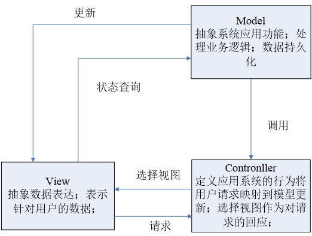

MVC 模式的出现，很好的解决了传统开发 WEB 应用方式中存在的问题。 M 代表模型（ Model ），包含完成任务所需要的所有的行为和数据； V 代表视图（ View ）界面，现实模型提供的数据； C 代表控制器（ Controller ），它将模型映射到界面中，处理用户的输入并相应请求。其模型的关系如图所示。在 MVC 模型中，三层各尽其职、相互独立，各层内部的改变不会影响到其它层，从而降低了数据表达、数据描述和应该操作的耦合度，也能更好的实现开发中的分工，加速工程进度。

### 4.3.	系统总体功能设计
图书管理系统包含五个模块分别是：系统登录、图书管理、学生管理、借阅信息管理、图书检索。
- 系统登录模块：一般用户和管理员都必须登录才能进入系统，用户登录时在后台判断用户的权限类型，分为普通用户和管理员，普通用户可以对书籍进行浏览及个人借阅信息的查- 询，管理员可以对多种信息进行操作。
- 图书管理模块：管理员通过验证界面进入系统后，进入到图书管理模块，可 以对图书进行添加，删除、修改图书信息、查询、查看等一系列的操作。
- 学生管理模块：管理员可以在此模块中创建新的普通用户，并且可以对用户的信息进行修改，删除等操作。
- 借阅信息管理模块：这是图书管系统中最重要的模块之一，管理员进入该模块中可以为普通用户办理借阅图书，归还图书的功能，并且能够实现还款的操作。
- 图书检索模块：普通用户通过验证界面进入系统后，能够按照书名，作者等多种条件对图书进行查询操作，确保查询到的都是最新的信息。
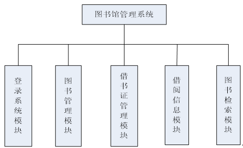

### 4.4.	系统功能模块涉及
#### 4.4.1.	登陆系统模块
用户进入系统时调用的一个模块。该模块根据用户输入的用户名、密码来判断用户的类型，跳转到该类用户的界面。
本模块的功能点包括：
- （1）   判断用户名和密码是否相符；
- （2）   根据用户的权限类型，登录到系统的制定界面操作使用 。

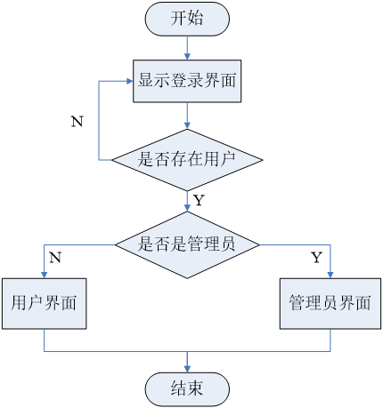
#### 4.4.2.	图书管理模块
在本模块中图书馆工作人员可以对图书进行管理操作。
本模块的功能点包括：
- （1）   新书入库，将新进图书按其类型将图书的基本信息录入系统数据库；  
- （2）   图书出库，某一部分图书会随着时间的增长及知识的更新而变得不再有收藏的价值，或者图书被损坏，这些图书就要在图书库中除去。即从图书库中删除此图书记录；
- （3）   新书编码，图书入库后，需要贴上条形码，以便以后提供借阅，本系统 不涉及到条形码阅读器，只是假定此过程已经生成条形码。编码只是将条形码帖于书上以唯一标识图书；
- （4）   图书信息修改，图书信息由于工作人员的疏忽，而出现录入错误，提供其图书 ID 就可以查看图书的基本信息并对其进行修改；

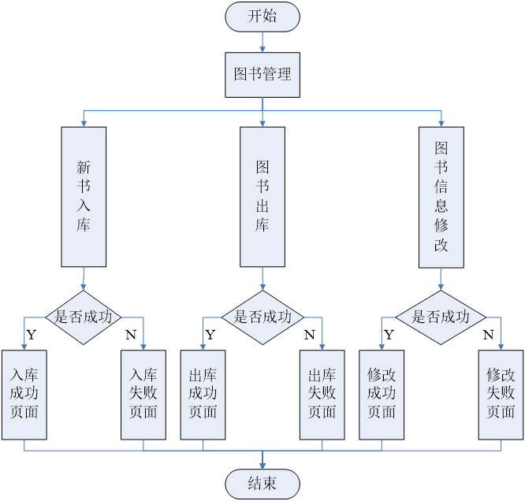
#### 4.4.3.	学生管理模块
本模块主要是工作者对学生信息（读者借书证信息）进行管理。
本模块的功能点包括：
- (1)	办理借书证，为新读者办理借书证，填写用户基本信息；
- (2)	注销借书证，输入读者借书证编号，根据借书证 ID 删除读者表中此借书证信息；
- (3)	修改读者信息，由于工作人员的疏忽，而出现办理借书证时录入信息有误，则可根据借书证编号对其信息进行查看和修改
- (4)	挂失借书证，主要是将借书证的状态改为挂失，更新读者表状态字段， 有图书管理员操作；

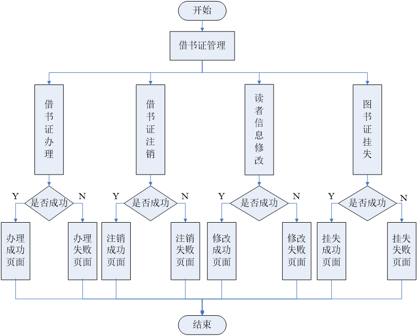

#### 4.4.4.	借阅信息管理模块
本模块主要是工作者对图书外借和归还进行管理。
本模块的功能点包括：
- (1)	图书借阅，记录借阅证编号和图书编号，进行借书过程。在数据库中插入一天借书记录，该记录包括图书 ID 、借书证 ID 、借阅日期、归还日期等；
- (2)	图书归还，输入借书证编号，图书编号，根据输入的编号在借阅登记表中找到相应的记录，将借阅记录删除，并将该记录相应的数据更新到历史借阅记录 信息表中；
- (3)	查看借阅记录，可以根据借书证 ID 以及图书 ID 查询借阅记录。
- (4)	办理还款，如读者有图书超期的情况将会有欠款，可以根据借书证的 ID 来为读者班里还款。

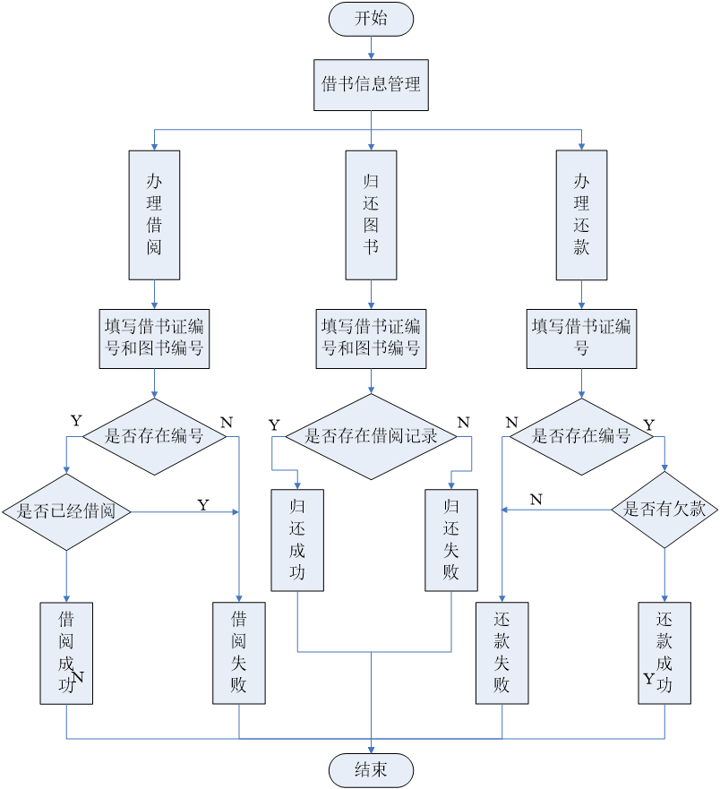

#### 4.4.5.	图书检索模块
使用该模块的用户有：读者和管理员。
本模块的功能点包括：
(1)	根据图书 ID 进行检索；
(2)	根据图书名称进行检索；
(3)	根据图书类型进行检索。
(4)	根据图书作者或译者进行检索 。

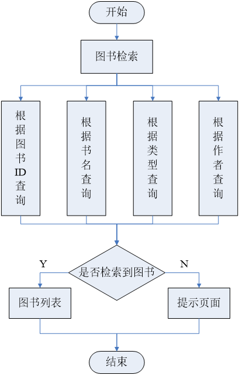
### 4.5.	系统数据库分析
#### 4.5.1.	基本数据库需求E-R图
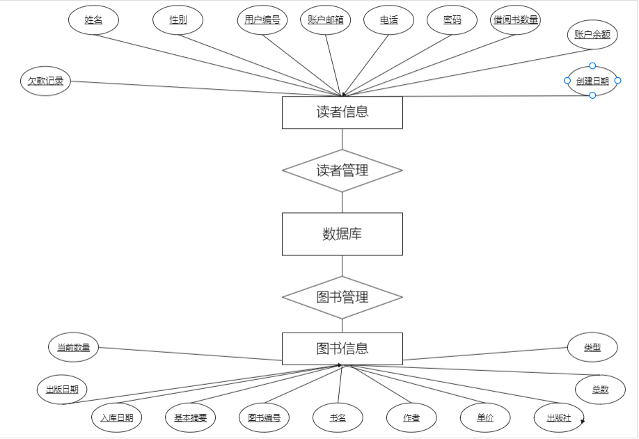
#### 4.5.2.	数据库结构设计

##### 4.5.2.1.	图书信息表

| 字段英文名称 | 字段中文名称 | 字段类型 | 字段约束 | 是否可为空 |
| ---- | ---- | ---- | ---- | ---- |
| Book_id | 图书编号 | Int | 主键 | 否 |
| Book_name | 书名 | String | 否 |否|
| Author | 作者 | String | 否 |否|
| Type_id | 类型 ID | Int |  |否|
| Price|单价|Double||是 |
| Pub_company|出版社|String||是 |
| PUB_DATE|出版日期|DATE||是 |
| Total_num|总数量|Int||否 |
| Current_num|当前数量|Int||否 |
| Buy_date|入库日期|Date||否 |
| Brief|内容摘要|String||是 |

##### 4.5.2.2.	读者信息表
| 字段英文名称| 字段中文名称| 字段类型| 字段约束| 是否可为空|
| ---- | ---- | ---- | ---- | ---- |
| User_id| 用户编号| Int| 主键| 否|
| Username| 姓名| String| | 否|
| Password| 密码| String| | 否|
| Sex| 性别| Boolean| | 是|
| Tele| 电话| String| | 是|
| Email| Email| String| | 是|
| Lended_num| 已借书数量| Int| 默认为 0| 否|
| Create_date| 创建日期| Date| | 否|
| Balance| 余额| Double| 默认为0| 否|
| Penalty_record| 欠款记录| Array| | 是|
| isActive| 状态| Int| 默认为0| 否|

##### 4.5.2.3.	图书借阅信息表
| 字段英文名称| 字段中文名称| 字段类型| 字段约束| 是否可为空|
| ---- | ---- | ---- | ---- | ---- |
| Record_id| 借阅记录ID | Int| 主键| 否|
| Book_id| 图书编号| Int  | | 否|
| Book_name| 图书名称| String| | 否|
|Author| 作者| String| | 否| |
|User_id| 借书用户编号| Int| | 否| | |
| Borrow_date | 借书日期| Date| | 否|
| Exp_return_date | 预计还书日期| Date| | 否|
| Act_return_date| 实际还书日期| Date| | 否|
| Penalty| 超期罚款| Int| | 否|

##### 4.5.2.4.	管理员表
| 字段英文名称| 字段中文名称| 字段类型| 字段约束| 是否可为空|
| ---- | ---- | ---- | ---- | ---- |
| Admin_id| 管理员 ID| Int| 主键| 否|
| Admin_name| 管理员姓名| Int| | 否|
| Admin_password| 管理员密码| Int| | 否|

##### 4.5.2.5.	图书类型表
| 字段英文名称| 字段中文名称| 字段类型| 字段约束| 是否可为空|
| ---- | ---- | ---- | ---- | ---- |
| Type_id| 类型 ID|  Int| 主键| 否|
| Type_name| 类别名|  String| 	否|

## 5.	系统测试
### 5.1.	登录模块测试
进入系统，输入用户名和密码，根据用户身份的不同，显示的操作菜单有所不同，一般读者只能查看图书信息和个人信息，并可以查询自己的借阅图书的历史记录；图书管理员可以对图书信息，读者信息以及借阅信息进行查看和管理。当输入错误的用户名称密码时显示登录错误并自动返回登录窗口。
### 5.2.	图书管理测试
图书管理员进入系统图书管理模块后，可对图书进行添加，修改，删除操作。

- (1)	添加图书，填写图书基本信息，点击确定按钮，添加成功跳转到成功页面并提示添加成功，可继续添加，添加失败跳转到失败页面并提示添加失败，请重新添加。当填写的信息不完全时，点击确定按钮将根据没有填写的信息给出提示。
- (2)	删除图书，单个删除时，点击删除则根据图书的 ID 删除此图书信息，成功则返回列表，不成功则提示未删除成功的原因，多选删除时也根据图书 ID 数组删除多个图书，并跳转到相应的提示页面。
- (3)	修改图书信息，点击查看图书信息时，可对图书信息进行修改，修改成功或失败跳转到相应提示页面。

### 5.3.	学生管理测试
图书管理员进入系统借书证管理模块后，可对借助正进行添加，修改，注销等操作。

- (1)	办理借书证，填写读者基本信息，点击确定按钮，添加成功跳转到成功页面并提示添加成功，可继续添加，添加失败跳转到失败页面并提示添加失败，请重新添加。当填写的信息不完全时，点击确定按钮将根据没有填写的信息给出提示。
- (2)	注销借书证，单个删除时，点击删除则根据借书证编号注销此借书证，成功则返回列表，不成功则提示未删除成功的原因，多选删除时也根据借书证 ID 的数 组删除多个借书证，并跳转到相应的提示页面。
- (3)	修改读者信息，点击查看读者借书证信息时，对其进行修改并根据结果成功或失败跳转到相应提示页面。

### 5.4.	借阅信息管理测试
图书管理员进入系统借阅信息管理模块后，可对借阅信息进行管理操作。

- (1)	办理借阅，根据读者借书证编号和图书编号办理读者借阅此图书，若图书剩余数量为 0 ，则提示不能借阅，图书数量不足，如此图书证已经借阅此图书，则提示不能借阅相同的图书，若借阅成功则转向成功界面。
- (2)	图书归还，根据读者借书证编号和图书编号办理归还图书，借阅信息中必须有这条信息，否则不能归还，跳转提示页面。图书归还成功后不再有这条借阅信息，图书数量加 1 ，并且计算好欠费情况。
- (3)	查看借阅信息，能够根据图书编号或借书证编号查询借阅信息。
- (4)	办理还款，根据读者借书证编号为读者办理还款业务，根据结果能够跳转到相应的提示页面。

## 6.	进度计划（负责人：A）
### 6.1.	初期整体进度计划
初期计划如下
| 任务| 完成时间| 负责人| 资源| 备注|
| ---- | ---- | ---- | ---- | ---- |
| 需求讨论| 2021/3/12| A| 开发人员参与|
| 模块设计| 2021/3/26| A| |
| 项目实施| 2021/4/3| A| | 需细化|
| 测试| 2021/4/8| A| |
| 提交| 2010/4/12| A|
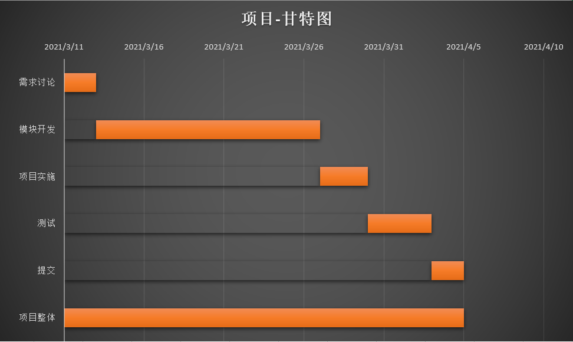

### 6.2.	开发计划进度

| 开始时间| 持续天数|
| ---- | ---- |
| 登陆系统模块| 2021/3/11| 1|
| 图书管理模块| 2021/3/12| 3|
| 学生管理模块| 2021/3/15| 4|
| 借阅信息管理模块| 2021/3/19| 4|
| 图书检索模块| 2021/3/23| 1|
| 项目实施| 2021/3/24| 3|
| 测试| 2021/3/30| 4|
| 图书管理系统| 2021/3/11| 23|

此表格作为更加详细的时间安排，但是由于是基本初步计划，只能作为指导时间线

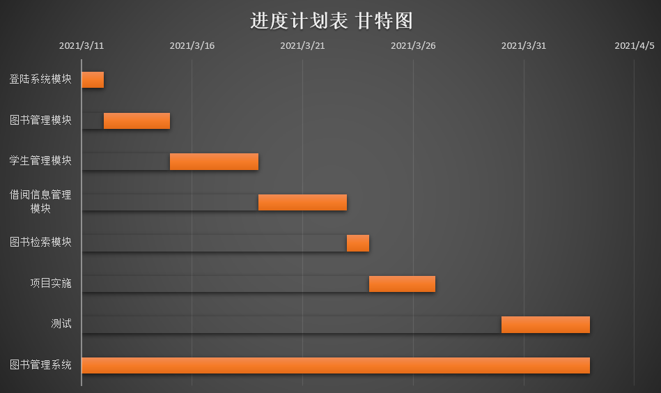
 
## 7.	项目人员计划（负责人：A）
### 7.1.	图书馆系统项目的组织结构

#### 项目管理
  - 负责项目的组织和规划
  - 负责项目计划制定和维护
  - 负责项目的跟踪和管理
  - 负责资源的分配和协调活动
  - 负责各组织和计划之间的协调活动
  - 负责与市场部的协调活动
#### 软件开发
  - 负责项目的软件开发，包括设计，编码，单元测试和集成测试
  - 负责产品质量的工作
  - 负责配合质量保证的活动，如系统测试，文档编制等
  - 配合产品验收的相关活动
#### 质量保证 
  - 负责项目过程和产品规范的制定
  - 负责项目过程的质量保证活动
  - 过程评审
  - 产品审计
#### 配置管理
  - 负责项目的配置管理活动
  - 负责软件产品的提交
#### 项目经理
  - 确保相关责任的实施
  - 参与项目的组织和规范
  -   负责产品的验收工作

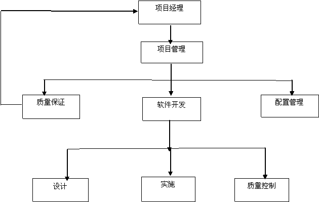

### 7.2.	项目基本人员安排
|项目经理 (PM)| A|
|---|---|
|需求分析员| A|
|进度安排员| A|
|质量保证代表| A|
|成本估算| B|
|人员安排| A|

## 8.	质量计划（负责人：A）
### 8.1.	导言
质量是产品保证，在日常生活中一个产品的质量决定了该产品的未来，没有好的质量产品是难以在现在这种竞争激烈的社会中生存的。   软件项目质量管理包括：质量计划编制、质量保证和质量控制三个过程域。现代质量管理的基本宗旨是： “ 质量出自计划，而非出自检查 ” 。只有做出精准的质量计划，才能指导项目的实施、做好质量控制。
### 8.2.	项目概述
详情见需求分析
### 8.3.	分析方法
此处的的分析方法可以采用因果分析图发法（又称鱼骨图法）如下图所示
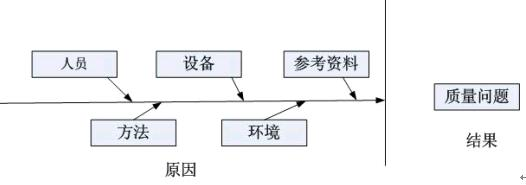

采用因果分析图可以描述相关的各种原因和子原因如何产生潜在问题或影响，将影响质量问题的“人员、设备、参考资料、方法、环境”等各方面的原因进行细致的分解，方便地在质量计划中制定相应的预防措施。其次，质量计划中还必须确定有效的质量管理体系，明确质量监理人员对项目质量负责和各级质量管理人员的权限。戴明环（又名 PDCA 循环法）作为有效的管理工具在质量管理中得到广泛的应用，它采用计划 —— 执行 —— 检查 —— 措施的质量环，质量计划中必须将质量环上各环节明确落实到各责任单位，才能保证质量计划的有效实施。
### 8.4.	项目组织

#### 8.4.1.	组织机构
  在项目实施期间成立质量保证组织，该组织有质量保证人员、质量保证组组长和项目经理组成，项目经理负责质量监督工作及其进展过程中各个环节的质量把关，开发经理负责质量控制工作，质量保证人员负责质量保证工作。其结构图如下所示。
 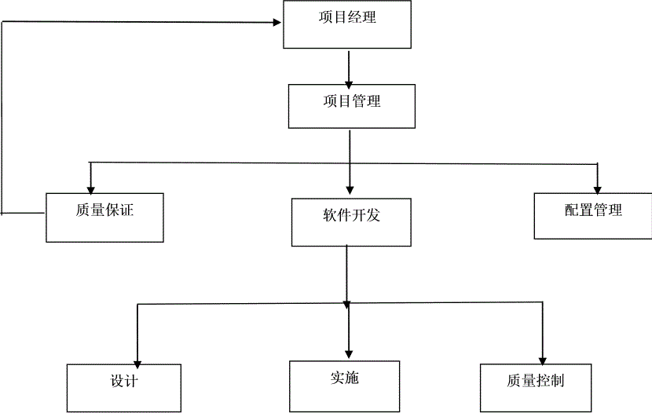
#### 8.4.2.	职责
  在本项目中，质量保证组织的职责如下：
##### 8.4.2.1.	项目经理 ：
- A.	职责评审质量计划；
- B.	与质量保证人员一起协商不符合项问题的纠正措施，并安排资源实施纠正措施；
- C.	定期或事件驱动的评审质量保证活动和结果。

##### 8.4.2.2.	项目质量保证人员 :
- A.	负责对项目的实施情况监督，包括对项目实施过程和产品进行监督检查；
- B.	制定质量保证计划；
- C.	实施项目组成人员的质量保证培训；
- D.	按计划实施审计活动，依照质量保证计划执行评审 / 审计，并记录执行中发现不符合项；
- E.	对不符合问题提交不符合项报告，跟踪并验证纠正措施的执行情况；
- F.	想项目经理报告项目质量工作状况和质量度量结果；
- G.	定期向项目经理报告作了很多的结果；
- H.	知道质量保证的过程改进计划，记录过程数据等。
### 8.5.	质量任务
#### 8.5.1.	质量目标
基于企业的质量方针和质量目标，结合本项目的特点，制定项目的质量目标：
- 1)	基于需求测试的覆盖率为 100%;
- 2)	软件功能测试用例通过率大于 95% ；
- 3)	每个阶段评审中发现的我难题都已经解决或得到处理；
- 4)	产品发布时不存在严重及其以上的缺陷。

#### 8.5.2.	质量策略
  为了保证我们的系统能够满足客户的要求与提高本系统的质量实施过程中我们采取了质量保证措施有以下几点 ;
- 1)  将质量贯彻到系统开发的整个过程中去；
- 2)  应该特别注意项目工作的产品质量的早期评审工作，无论是质量的早期评审工作还是质量控制- 的采取策略都是早期预防和早期排除缺陷；
- 3)  在项目过程中要注意每个环节完成后记录，并对每个工作人员现在状态也要进行记录，同时对每次的评审都要进行记录。以便后期的问题发现和后期对问题纠错等问题的方便。
#### 8.5.3.	活动反馈方式和争议上报方式
  质量保证人员对每次审计活动中发现的不符合项，应该和项目经理协商不符合项的纠正措施及预定完成日期，若和项目经理存在意见分歧，基本以项目经理的意见为主。
- 1)	活动反馈方式主要是通过文件形式，通过项目组会议或者项目讨论时提出，如有特殊情况（如特大问题等）可直接与项目经理进行反馈并及时修改纠正。
- 2)	在争议上报中主要通过直接的组员间的交流以文本形式上报到项目经理，在通过经理的决策后解决争议继续工作。
  对不合项和争议质量保证人员要在预定日期内完成。重新审计，验证不符合项的纠正情况，若超过预定时间日期 2 天仍没有解决的。项目经理要及时参与决定最后措施。
同时项目保证人员有独立的汇报途径，日常途径如下：
- 1)	发现问题通知上一级质量保证人员，协助纠正措施；
- 2)	将项目组内部能协调解决的问题汇报给项目管理者，有项目经理协调管理。
- 3)	日常工作和过程数据要汇报质量组长同意收集、统计。
#### 8.5.4.	质量控制活动
  该过程主要有程序开发人员负责，这部分包括代码走查、单元测试、集成测试、环境测试等，编写人员要进行单元测试，单元测试要达到分支覆盖，产品通过单元测试和编码检查后，应该提交到测试部进行集成测试、系统测试。测试部的测试也要达到质量目标要求，软件发布时测试通过准则要求。
### 8.6.	实施计划
#### 8.6.1.	工作计划
  工作计划主要是指对质量保证的具体活动，该内容主要体现在前面的具体进度计划中。
质量保证的主要活动包过程审计和产品审计。这两个活动主要是为了保证产品进展过程中各个阶段和各个方面的采取各项措施来保证和提高提交给客户的产品质量。每次过程审计动员填写相应的报告和活动记录。这些在上面已经提到过。
##### 8.6.1.1.	产品审计  
  产品审计有质量保证人员来进行，主要检查项目产品是否达到质量目标。
在此处保证人员可以选择性进行审计。
##### 8.6.1.2.	过程审计
  项目要严格按照组织定义的软件过程进行开发，过程审计的具体参照我们小组的过程规范，保证项目的所有过程活动都在实施的范围内。
审计形式可以采取文件传阅和评审会等。
  质量保证人员负责项目过程进行监督，发现的问题和解决情况在每次会议上通报，对没有解决的问题进行讨论，对不能解决的问题交由上一级的管理者处理。
#### 8.6.2.	项目经理定期和基于事件的评审
  项目经理在对项目做定期的评审，同时都与突发事件项目经理应当立即评审，并给出相应的解决方案。项目经理对评审时要从多方面多因素进行考虑，不能以个人情感为主和个人主观想法为主，要以项目的长远利益考。
#### 8.6.3.	实施过程中的其他注意事项
  在实施过程中要注意多于项目开发组员进行沟通，尽量给与组员良好的工作环境，同时提供相关方面的资料供组员们参考等尽量创造好的周边环境。这样可以减少产品生产过程中一些其他因素引起的质量问题。
### 8.7.	记录的收集、维护和保存
  项目组应当保留项目过程执行过程中形成的各类文档、各种记录、各级会议记录、和个中周报、对于项目中处理也要形成记录保存。每周有质量保证人员根据任务清单的审计任务进行审计活动并收集活动的过程数据。
## 9.	成本预算（负责人：B）
  在编制图书管理系统项目计划中考虑到， 4  个开发人员是全职在这个项目中，二项目经理，质量保证和配置管理人员不是全职在这个项目中，他们还同时在管理其他的项目，进行成本估算的时候，应该根据项目人员付出的   时间以及各项任务的具体情况进行成本预算，最后得到比较详细的成本分配情况，即成本基准。滋养费用比例如下表所示：
|类型|最大单位|标准费率|加班费率|每次使用成本|成本累算|基准日历|
|---|---|
|工时|100%|￥ 0.00/ 工时|￥ 0.00/ 工时|￥ 0.00|按比例|标准|
|工时|100%|￥ 0.00/ 工时|￥ 0.00/ 工时|￥ 0.00|按比例|标准|
|工时|100%|￥ 0.00/ 工时|￥ 0.00/ 工时|￥ 0.00|按比例|标准|
|工时|100%|￥ 0.00/ 工时|￥ 0.00/ 工时|￥ 0.00|按比例|标准|
|工时|100%|￥ 0.00/ 工时|￥ 0.00/ 工时|￥ 0.00|按比例|标准|
|工时|100%|￥ 0.00/ 工时|￥ 0.00/ 工时|￥ 0.00|按比例|标准|

## 10.	项目跟踪
### 10.1.	任务跟踪
本小组每周开两次例会，分别是 : 每周周一和周五的中午 12:50-13:50 。
《个人工作进展报告》每两个星期提交一次。

### 10.2.	问题跟踪
小组成员提出的问题可以通过发邮箱的形式发到小组的公共的邮箱 ********@qq.com ，并通过 QQ 群。手机短信等方式通知经理和相关成员，由相关的人员组织会议，及时解决问题。小组的活动有专门的记录员记录问题的重要性和内容，需要更改的需求和设计的内容列表，形成项目的问跟踪文档，为后来的开发提供经验。

| 